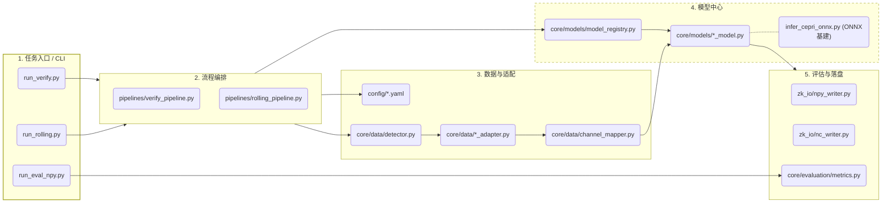
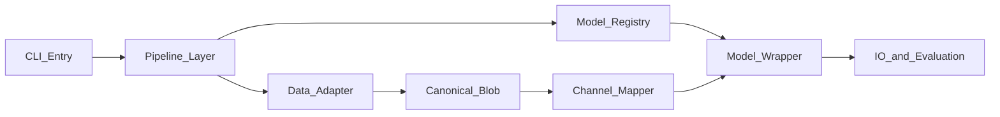

# unified_pipeline

`unified_pipeline` 是 `ZK_Models` 的统一推理与评估平台，覆盖：

- 功能一：初步推理验证（`run_verify.py`）
- 功能二：滚动推理（`run_rolling.py`）
- 仅评估：基于已有 NPY 重跑指标（`run_eval_npy.py` / `run_evaluate.py`）

该目录聚焦推理与评估，不包含训练流程。

## 1. 项目目标

通过统一的“模型注册 + 数据适配 + 通道映射 + 流水线编排”架构，解耦：

- 数据格式（`era5_flat` / `gundong_20260324` / 可扩展）
- 模型实现（Pangu/FengWu/FuXi/GraphCast/GraphCast_CS）
- 运行场景（verify / rolling / offline eval）

### 快速阅读导航（建议）

- **5 分钟速览**：先看 `2 实际架构` -> `3.2 按分层理解` -> `7 快速开始`。
- **30 分钟上手改动**：再看 `5 配置文件说明` -> `12 扩展指南（深度版）`。
- **准备提 PR**：最后看 `13 Branch and PR Workflow` 与 `14 Version and Change Log`。

## 2. 实际架构（与当前代码一致）




## 3. 目录结构与文件职责（维护视角）

### 3.1 全量关键文件（建议先读）

```text
unified_pipeline/
├── config/
│   ├── models.yaml
│   ├── data.yaml
│   └── defaults.yaml
├── core/
│   ├── data/
│   │   ├── base_adapter.py
│   │   ├── detector.py
│   │   ├── era5_adapter.py
│   │   ├── gundong_adapter.py
│   │   ├── channel_mapper.py
│   │   └── surface_units.py
│   ├── models/
│   │   ├── base_model.py
│   │   ├── model_registry.py
│   │   ├── pangu_model.py
│   │   ├── fengwu_model.py
│   │   ├── fuxi_model.py
│   │   └── graphcast_model.py
│   ├── evaluation/
│   │   └── metrics.py
│   └── monitoring/
│       └── hardware_logger.py
├── pipelines/
│   ├── verify_pipeline.py
│   └── rolling_pipeline.py
├── zk_io/
│   ├── npy_writer.py
│   ├── nc_writer.py
│   └── plot_utils.py
├── scripts/
│   ├── submit_verify.sh
│   ├── submit_rolling.sh
│   ├── submit_evaluate.sh
│   └── submit_gundong_20260303_5models.sh
├── run_verify.py
├── run_rolling.py
├── run_eval_npy.py
├── run_evaluate.py
├── infer_cepri_onnx.py
├── cepri_loader.py
├── evaluate_models.py
├── test_core.py
├── runtime_paths.py
├── requirements-ci.txt
├── AGENTS.md
├── CHANGELOG.md
├── USAGE.txt
└── .github/workflows/pr-gate.yml
```

### 3.2 按分层理解：什么时候该改哪个文件

- **CLI 入口层（`run_*.py`）**：
  - 管理参数解析、默认参数装配、日志与入口分流。
  - 想加新命令参数/默认行为，先看这里，再看 `config/defaults.yaml`。
- **流水线层（`pipelines/*.py`）**：
  - `verify_pipeline.py`：短步验证、输出三联图。
  - `rolling_pipeline.py`：多步滚动推理、可选内嵌评估、并行切分、输出组织。
  - 想改“执行流程/步进策略校验/输出目录规则”，优先改这里。
- **模型层（`core/models/*.py`）**：
  - `model_registry.py` 负责按 `config/models.yaml` 动态构建模型实例。
  - 每个模型类负责 `load/init_state/step/get_step_hours`。
  - 想接入/替换模型权重、模型推理逻辑，优先改这一层。
- **数据层（`core/data/*.py` + `cepri_loader.py`）**：
  - `detector.py` 选择数据适配器；`*_adapter.py` 负责读原始数据；`channel_mapper.py` 负责 blob <-> 模型张量。
  - `cepri_loader.py` 是 CEPRI NetCDF 读取工具，被 adapter 和 ONNX 工具复用。
  - 想接新数据格式或改变量映射，优先改这一层。
- **ONNX 共享工具（`infer_cepri_onnx.py`）**：
  - 不是仅“历史脚本”，它同时是 `pangu/fengwu/fuxi` 模型包装类使用的 ORT 工具库（session/provider/temb/单步推理辅助）。
  - 想改 ONNX provider 选择、会话参数、FuXi temb 细节，优先改这里。
- **评估与输出层（`core/evaluation/metrics.py` + `zk_io/*.py`）**：
  - 指标计算、图表、NC/NPY 写出。
  - 想新增指标、统一图例、调整落盘格式，改这一层。
- **治理与 CI（`AGENTS.md`、`.cursor/rules/`*、`.github/workflows/pr-gate.yml`）**：
  - 约束分支/PR 流程、必要检查和文档同步要求。
  - 想调整门禁和协作流程，改这一层。

## 4. 路径约定

见 `runtime_paths.py`：

- `UNIFIED_PIPELINE_ROOT`：本目录（代码与配置）
- `ZK_MODELS_ROOT`：上级 `ZK_Models`（ONNX 权重等）
- `GRAPH_CAST_ROOT`：`graphcast` 工程根（运行时会 `os.chdir` 到此）

因此脚本可从任意目录调用，但默认相对路径行为以 `GRAPH_CAST_ROOT` 为准。

## 5. 配置文件说明

### `config/models.yaml`

- 管理模型注册、启用状态、权重路径和模型元信息
- 支持占位符：
  - `${ZK_ROOT}` -> `ZK_MODELS_ROOT`
  - `${GRAPH_ROOT}` -> `GRAPH_CAST_ROOT`
- 当前内置模型：
  - `pangu`
  - `fengwu`
  - `fuxi`
  - `graphcast`
  - `graphcast_cs`
- `pangu` 支持调度策略：
  - `scheduler_mode: six_hour_only`：仅使用 6h 模型（当前默认，便于和历史脚本对齐复核）
  - `scheduler_mode: hybrid_24h`：`+24h/+48h/...` 使用 24h 模型，其余使用 6h 模型
- `fuxi` 支持可配置级联与 temb：
  - `infer_mode: cascade|fixed`（默认 `cascade`）
  - `cascade_split_step: 20`（默认前 20 步 `short`，后续 `medium`）
  - `temb_mode: zforecast|legacy`（默认 `zforecast`）
  - `tp_fallback: zero|error`（缺失 `surface_tp_6h` 时回退策略）

### `config/data.yaml`

- 管理数据源名称到真实路径与格式的映射
- `format` 可显式指定，也可由 `core/data/detector.py` 自动探测
- 当前内置数据源：
  - `test_era5`（`era5_flat`）
  - `gundong_20260324`（`gundong_20260324`）

### `config/defaults.yaml`

- verify/rolling/eval 默认参数
- CLI 参数优先级高于该文件

## 6. 环境与依赖

**默认 conda 环境（推荐，与 `scripts/submit_*.sh` 中 `CONDA_ENV` 默认值一致）：**

- `torch2.4_dtk25.04_cp310_e2s`

本地或交互式运行前请先：

```bash
conda activate torch2.4_dtk25.04_cp310_e2s
```

如需改用其他环境，Slurm 提交时设置 `CONDA_ENV=你的环境名` 即可覆盖默认值。

代码依赖（从导入与脚本推断）：

- `python>=3.10`
- `numpy`
- `PyYAML`
- `xarray`
- `pandas`
- `matplotlib`
- `onnxruntime`
- `torch`
- `netCDF4`（xarray 读取 NC 常见后端）

集群脚本（`submit_verify.sh` / `submit_rolling.sh` / `submit_evaluate.sh`）默认使用上述 conda 环境；可通过环境变量 `CONDA_ENV` 覆盖。

**GitHub Actions（PR 门禁）**：`.github/workflows/pr-gate.yml` 在合并前会做编译与轻量 `import` 自检。Runner 通过根目录 `[requirements-ci.txt](requirements-ci.txt)` 安装与这些自检一致的最小 pip 依赖（含 `netCDF4`、`onnxruntime` 等 import 链所需项；**不含** `torch` 等与 GraphCast 实跑相关的重型包）。完整推理与评估仍以本节的 conda / 集群环境为准。

- Slurm + DTK/ROCm（或 `USE_CUDA=1` 切 CUDA）

## 7. 快速开始

### 7.1 查看参数

```bash
cd /public/home/aciwgvx1jd/new-onescience/onescience/examples/earth/graphcast
python ZK_Models/unified_pipeline/run_rolling.py --help
python ZK_Models/unified_pipeline/run_verify.py --help
```

### 7.2 功能一：初步推理验证

```bash
python ZK_Models/unified_pipeline/run_verify.py \
  --models pangu fengwu \
  --data-source test_era5 \
  --date 20260308 \
  --hour 12 \
  --num-steps 2 \
  --all-surface
```

输出默认在 `results/verify`（可通过 `--output-root` 指定）。

### 7.3 功能二：滚动推理

```bash
python ZK_Models/unified_pipeline/run_rolling.py \
  --models all \
  --data-source gundong_20260324 \
  --date-range 20260308 \
  --init-hour 12 \
  --lead-step 6 \
  --max-lead 240
```

常用开关：

- `--enable-eval`：推理过程中内嵌评估
- `--save-diff` / `--save-diff-nc`：保存差值场
- `--skip-plots`：跳过对比图
- `--save-nc`：保存逐步 NC
- `--parallel-mode auto|date|model`：多卡分片策略
- `--lead-step` 必须能被模型步长整除，否则会直接报错退出（避免错配推理）

### 7.4 已有 NPY 的离线评估（推荐）

```bash
python ZK_Models/unified_pipeline/run_eval_npy.py \
  --data-source gundong_20260324 \
  --date-range 20260310 \
  --init-hour 12 \
  --max-lead 240 \
  --lead-step 6 \
  --models pangu fengwu fuxi graphcast graphcast_cs \
  --output-root /public/share/aciwgvx1jd/GunDong_Infer_result_12h
```

### 7.5 旧入口评估（兼容）

```bash
python ZK_Models/unified_pipeline/run_evaluate.py \
  --time-tag 20260308T12 \
  --models FengWu GraphCast FuXi PanGu \
  --variables u10 v10 t2m
```

## 8. Slurm 提交

任务提交规范：**仅使用以下三个脚本**（通过环境变量覆盖参数）。

在 `unified_pipeline` 目录下：

```bash
sbatch scripts/submit_verify.sh
sbatch scripts/submit_rolling.sh
TIME_TAG=20260308T12 sbatch scripts/submit_evaluate.sh
```

`scripts/submit_gundong_20260303_5models.sh` 已标记为兼容用途（deprecated），不建议新任务继续使用。

脚本参数支持环境变量覆盖，例如：

```bash
MODELS="fengwu fuxi" DATE_RANGE="20260301:20260318" ENABLE_EVAL=1 sbatch scripts/submit_rolling.sh
```

### 8.1 日志首屏字段解读（排障建议）

三个 `submit_*` 脚本都会在日志开头打印：

- `submit_script`：仓库内对应脚本的绝对路径（例如 `.../unified_pipeline/scripts/submit_rolling.sh`）。**请勿与 Slurm 在计算节点上的临时副本混淆**（见下）。
- `slurm_batch_copy`（仅 Slurm 作业）：`sbatch` 在节点上实际执行的脚本副本路径，常见为 `.../spool_slurmd/job<ID>/slurm_script`，这是正常现象。
- `slurm_submit_dir`（仅 Slurm 作业）：执行 `sbatch` 时的工作目录（`SLURM_SUBMIT_DIR`）。
- `python_entry`：本次执行的 Python 入口绝对路径
- `ENV snapshot`：关键环境变量快照（模型、时间范围、步长、并行参数等）
- `CMD`：最终展开后的命令行
- `FuXi first step`：首步会打印 `mode`、`active`、`split`、`temb_mode`、`layout`，用于核对级联和时间嵌入配置

建议每次作业先核对上述字段，再进入结果分析，避免“脚本/参数/模型路径不一致”导致误判。

## 9. 输出说明

### 滚动推理输出

- 预报 NPY：`{output_root}/{Model}/ERA5_6H/*.npy`
- 对比图：`{output_root}/plots/{model_slug}/{init_tag}/*.png`
- 可选 NC：`{output_root}/{init_tag}/nc/{model_slug}/lead_*.nc`

### 评估输出

- 评估目录：`{output_root}/eval_{max_lead}h_{time_tag}/`
- 典型产物：
  - 指标汇总 CSV
  - 指标时序图
  - 可选 diff npy/nc

## 10. 设计日志对照审查结论

相对设计日志 `zk_models_refactor_a47e936d.plan.md`，当前仓库状态结论如下：

- 已落地：`config/`、`core/data`、`core/models`、`core/evaluation`、`core/monitoring`、`pipelines/verify_pipeline.py`、`pipelines/rolling_pipeline.py`、`run_verify.py`、`run_rolling.py`、`run_evaluate.py`、`scripts/*.sh`
- 实际增强：
  - 目录名采用 `zk_io/`（非设计稿中的 `io/`）
  - 增加 `run_eval_npy.py`（仅评估、无需加载模型）
  - 模型注册包含 `graphcast_cs`
  - 保留 `evaluate_models.py` 作为兼容/历史工具
  - `infer_cepri_onnx.py` 同时承担 ONNX 模型共享推理工具库职责（非纯历史文件）

## 11. 常见问题

- `ValueError: 无法自动识别数据格式`
  - 在 `config/data.yaml` 显式填写 `format`
- 模型加载失败
  - 检查 `config/models.yaml` 权重路径占位符展开后是否存在
- 评估无结果
  - 检查 `date-range`、`init-hour`、`lead-step` 与输出 NPY 的 `init_tag` 是否一致
- GPU 利用率低
  - `WORLD_SIZE=1` 串行多模型时属于预期；可用 `WORLD_SIZE>1` + `--parallel-mode model|date` 提升并发
- FuXi 首步日志里 `tp_mean` 接近 0
  - 说明当前数据源未提供 `surface_tp_6h`，触发了 `tp_fallback`
  - 若需严格对齐官方 70ch 输入语义，建议在数据适配器中补充 6h 累计降水字段

## 12. 扩展指南

### 12.1 新增/修改模型：推荐改动路径




**最小改动清单（按顺序）**

1. 在 `config/models.yaml` 增加 `models.<new_slug>` 条目（`enabled/type/paths/display_name/...`）。
2. 在 `core/models/` 新增 `<new_slug>_model.py`，实现 `WeatherModel` 关键方法：
  - `load(cfg, device)`
  - `init_state(init_blob, prev_blob, init_time)`
  - `step(state)`
  - `get_surface_var_names()`
  - `get_step_hours()`
3. 在 `core/models/model_registry.py` 的 `_get_model_classes()` 注册新 slug 到类。
4. 如新模型张量格式与现有不兼容，在 `core/data/channel_mapper.py` 新增：
  - `blob -> model_input` 转换
  - `model_output -> blob` 反转换
5. 如需 ONNX 辅助能力（session/provider/temb/归一化等），在 `infer_cepri_onnx.py` 增补工具函数，并在模型类调用。
6. 补齐展示与评估映射（按需）：
  - `pipelines/rolling_pipeline.py` 的展示名映射与评估顺序
  - `pipelines/verify_pipeline.py` 的 `_verify_out_label`
  - `run_eval_npy.py` 的 `_SLUG_TO_DISPLAY` / 默认模型列表
7. 更新 README 当前章节中的“模型流程模板”（新增模型后必须补充该模型流程）。

**高频坑位**

- `lead_step` 与模型 `get_step_hours()` 不整除：`rolling_pipeline.py` 会直接报错退出。
- 需要 `prev_blob` 的模型（如 FengWu/FuXi）若缺前一时次，会导致 `init_state` 失败。
- 模型内部通道名与统一输出变量名（`u10/v10/t2m/msl`）映射不一致，会导致评估和作图异常。
- `config/models.yaml` 路径占位符展开依赖 `model_registry._expand_vars`，错误路径通常在 `load()` 才暴露。

**快速验证建议**

```bash
# 1) 语法/导入快速检查
python -m compileall run_verify.py run_rolling.py run_eval_npy.py run_evaluate.py core pipelines zk_io
python - <<'PY'
import importlib
for mod in [
    "run_verify", "run_rolling", "run_eval_npy", "run_evaluate",
    "core.models.model_registry", "core.data.channel_mapper",
]:
    importlib.import_module(mod)
print("import checks passed")
PY

# 2) 最小 verify 冒烟（单模型、少步）
python run_verify.py --models <new_slug> --data-source test_era5 --date 20260308 --hour 12 --num-steps 1 --all-surface
```

### 12.2 现有 5 个模型配置流程（深度）

以下流程统一从 `config/data.yaml -> core/data/detector.py -> adapter.load_blob()` 开始，得到 canonical blob。

#### A) `pangu`

- **配置入口**：`config/models.yaml -> models.pangu`
  - 关键键：`paths.6h`（必需）、`scheduler_mode`（`six_hour_only|hybrid_24h`）
  - 可选：`paths.24h`（仅 `hybrid_24h` 时生效）
- **输入转换**：`core/data/channel_mapper.py::blob_to_pangu_onnx`
- **包装类关键函数**：`core/models/pangu_model.py`
  - `load()`：创建 6h/24h ORT session
  - `init_state()`：blob -> (`p_in`, `s_in`)
  - `step()`：按调度策略选择 6h 或 24h session
- **输出反转换**：`pangu_onnx_to_blob`
- **步进策略**：模型内单步 6h；`hybrid_24h` 仅在 `next_lead % 24 == 0` 且 `24h` session 存在时走 24h。
- **修改时优先检查**：`pangu_model.py::step` 与 `infer_cepri_onnx.py::pangu_one_step`

#### B) `fengwu`

- **配置入口**：`config/models.yaml -> models.fengwu`
  - 关键键：`paths.v2|v1`、`default_version`、`stats_dir`
- **输入转换**：`blob_to_fengwu_138ch` 或 `blob_to_fengwu_69ch`（由 ONNX 输入 shape 自动判定）
- **包装类关键函数**：`core/models/fengwu_model.py`
  - `load()`：加载 session + 识别输入模式（138/189/69）
  - `init_state()`：138ch 模式必须依赖 `prev_blob`
  - `step()`：推理、反归一化、滚动更新输入窗口
- **输出反转换**：`fengwu_pred69_to_blob`（配合 `fengwu_denorm_chw`）
- **步进策略**：固定 6h 自回归。
- **修改时优先检查**：`fengwu_model.py::init_state/step` 与 `channel_mapper.py` FengWu 映射函数

#### C) `fuxi`

- **配置入口**：`config/models.yaml -> models.fuxi`
  - 关键键：`paths.short|medium`、`infer_mode`、`cascade_split_step`、`temb_mode`、`tp_fallback`
- **输入转换**：`blobs_to_fuxi_2frame` + `fuxi_prepare_onnx_input`
- **包装类关键函数**：`core/models/fuxi_model.py`
  - `load()`：按 `infer_mode` 加载 short / medium session
  - `init_state()`：需要 `init_blob + prev_blob`
  - `step()`：根据 step index 决定 short 或 medium，并构造 temb 输入
- **输出反转换**：在 `fuxi_model.py::step` 中按通道索引直接切片，组装 `blob_new`（`surface_t2m/u10/v10/msl`）。
- **步进策略**：固定 6h；`cascade` 模式在 `cascade_split_step` 后切换 medium。
- **修改时优先检查**：`fuxi_model.py::step`、`infer_cepri_onnx.py::fuxi_temb`*、`tp_fallback` 语义

#### D) `graphcast`

- **配置入口**：`config/models.yaml -> models.graphcast`
  - 关键键：`model_config`、`model_config_key`、`checkpoint`、`stats_dir`、`static_dir`、`metadata_json`
- **输入转换**：`blob_to_graphcast_norm`
- **包装类关键函数**：`core/models/graphcast_model.py`
  - `load()`：加载 GraphCastNet、统计量、静态场与 metadata
  - `init_state()`：blob -> 归一化输入状态
  - `step()`：前向推理 + 反归一化 + 回写 blob
- **输出反转换**：`graphcast_norm_to_blob`
- **步进策略**：`get_step_hours() = int(model_cfg.dt)`（通常 6h）。
- **修改时优先检查**：`graphcast_model.py::load/step` 与 metadata 通道顺序一致性

#### E) `graphcast_cs`

- **配置入口**：`config/models.yaml -> models.graphcast_cs`
  - 与 `graphcast` 的主要差异：`checkpoint/stats_dir/static_dir/metadata_json`
- **模型代码**：仍复用 `core/models/graphcast_model.py`（注册名不同，类相同）
- **步进策略**：与 GraphCast 一致，取 `dt`。
- **修改时优先检查**：配置路径有效性、metadata 与 checkpoint 对齐，而不是另写模型类。

### 12.3 新增数据格式

1. 在 `core/data/` 新增 `DataAdapter` 子类并实现统一 blob 合约。
2. 在 `core/data/detector.py` 的 `_FORMAT_MAP` 注册格式名（或调用 `register_format`）。
3. 在 `config/data.yaml` 增加数据源条目（`root` + `format`）。

### 12.4 新增评估指标

1. 在 `core/evaluation/metrics.py` 添加指标计算与聚合逻辑。
2. 通过 CLI `--metrics` 或 `config/defaults.yaml` 启用。

## 13. Branch and PR Workflow

为避免功能开发污染 `main`，本仓库采用分支开发 + PR 审核合并流程：

1. 新需求在独立分支开发（`feature/`*、`fix/*`、`chore/*`）
2. 每个脚本/逻辑单元独立验证后再 commit
3. 推送分支后创建 PR 到 `main`
4. `pr-gate` 检查通过 + reviewer 批准后才允许合并

推荐命令：

```bash
git switch -c feature/your-topic
# edit + validate
git add <files>
git commit -m "your message"
git push -u origin feature/your-topic
gh pr create --base main --head feature/your-topic
```

配套文件：

- `AGENTS.md`：仓库级 agent 工作契约
- `.cursor/rules/branch-pr-workflow.mdc`：Cursor agent 强约束规则
- `.github/pull_request_template.md`：PR 模板
- `.github/CODEOWNERS`：审查责任定义
- `.github/workflows/pr-gate.yml`：PR 必需检查

### Main Protection (GitHub Settings)

在 GitHub 仓库的 `Settings -> Branches -> Branch protection rules` 中为 `main` 设置：

- Require a pull request before merging
- Require approvals: `1`（可按团队提升到 `2`）
- Require status checks to pass before merging: `pr-gate / basic-checks`
- Require conversation resolution before merging
- Restrict who can push to matching branches（建议仅维护者）
- Include administrators（建议开启）

## 14. Version and Change Log

本仓库使用 `CHANGELOG.md` 记录每次主分支合并后的版本信息与测试简报。

维护要求：

1. 对功能/修复/配置/流程改动，PR 必须同步更新 `CHANGELOG.md`（或在 PR 里说明 `N/A` 原因）。
2. 优先写入 `Unreleased` 区域，合并后整理为具体版本块。
3. 每条版本记录至少包含：
  - Version
  - DateTime
  - Merged PR/Branch
  - Summary of Changes (all)
  - Test Report (brief)
  - Related Commits

版本号约定（最小语义化版本）：

- `vMAJOR.MINOR.PATCH`
- `MAJOR`：不兼容变更
- `MINOR`：向后兼容的新功能
- `PATCH`：向后兼容的修复与非功能性优化

